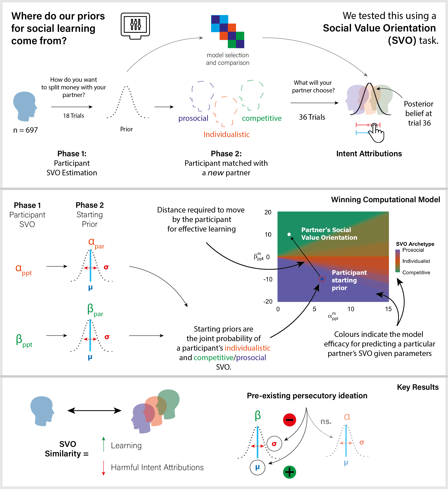

# IntentionsGameModel
Models and data describing participant social learning about different partner Social-Value Orientations (SVO) given their own SVO preferences in Barnby et al., 2021.

# Models

Data structure required for models are like so

ID | Trial | Option1 Self | Option1 Other | Option2 Self | Option2 Other | PPT Choice/Prediction | Partner Answer | PPT Choice Categorical | Correct
------------ | ------------- | ------------- | ------------- | ------------- | ------------- | ------------- | ------------- | ------------- | -------------
1 | 1 | 8 | 8 | 8 | 5 | 1 | - | 1 | -
... | ... | ... | ... | ... | ... | ... | ... | ... | ...
1 | 18 | 10 | 6 | 8 | 2 | 1 | - | 2 | -
1 | 19 | 7 | 7 | 10 | 6 | 1 | 1 | 1 | 1
... | ... | ... | ... | ... | ... | ... | ... | ... | ...
1 | 54 | 6 | 2 | 8 | 5 | 2 | 1 | 2 | 0

Matlab files of models to enable the CBM (Piray et al., 2018) function - for a guide on how to use these series of useful function, see Payam's useful guide online here https://payampiray.github.io/cbm.

Each model is contained in a single .m file.

Each model is fitted using Laplace approximation and concurrently compaired in the Master '.m' file.

Modelling requires the installation of the 'parfor' function in the parralell toolbox in Matlab. 

<b> NB: Model fitting for the Bayesian models will take a long time. </b> Adjust your expectations accordingly. 

Approximate time commitment for fitting 697 participants using 8 cores:

<i> machine specs:  MacBook Pro 2.6 GhZ 6-Core (12 virtual cores) Intel Core i7, 16GB DDR4 RAM </i>

 - heuristic model fitting (4-6 parameters) ~ 1 hour
 - 4 parameter Bayes model laplace approximation ~ 6 hours
 - 5 parameter Bayes model laplace approximation ~ 9 hours
 - 6 parameter Bayes model laplace approximation ~ 12-14 hours
 - Concurrent Bayesian fitting for all model ~ 96+ hours
 - Concurrent Bayesian fitting & null model fitting for the final 3 selected models ~ 12 hours

If you figure out a script to connect to a cluster to run these analyses this would be probably optimal for your time and your sanity, and please share with me if possible so I can add it! :)

# Analysis

The winning model is imported into the .R script to test and assess.
All visualisations and regression models are completed with this script.
Required packages for each analyses are loaded and listed at the start.

<i>NB: Graphical abstract and Figure 1 made using Adobe Illustrator </i>
